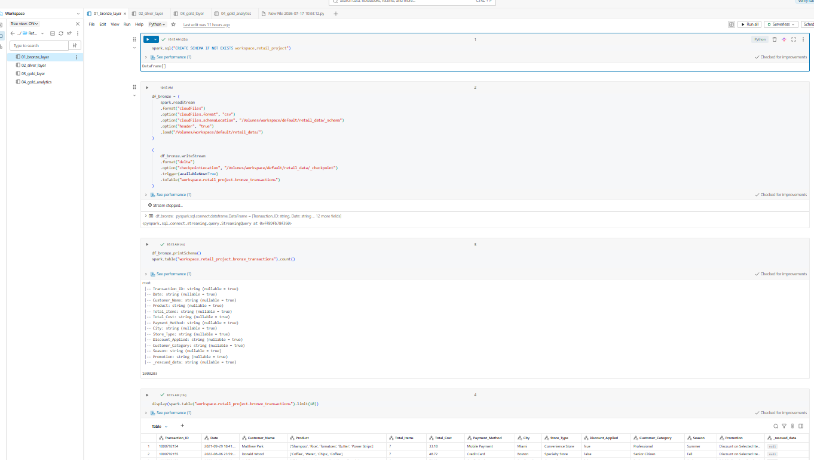
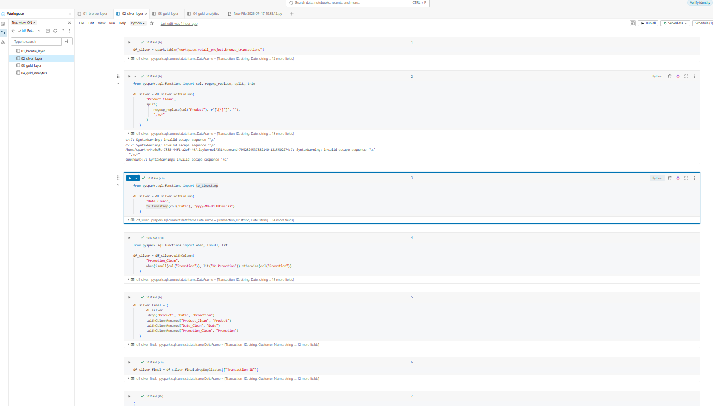
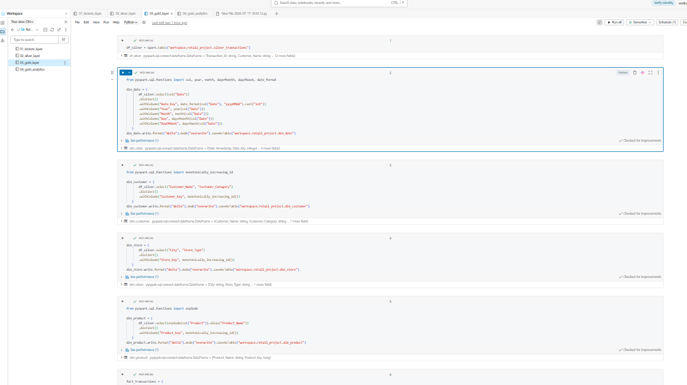
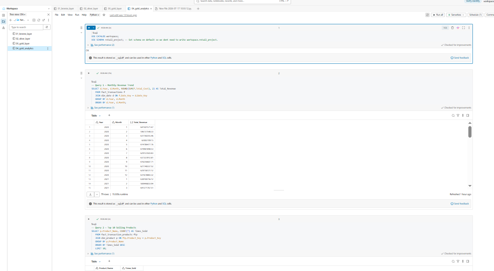
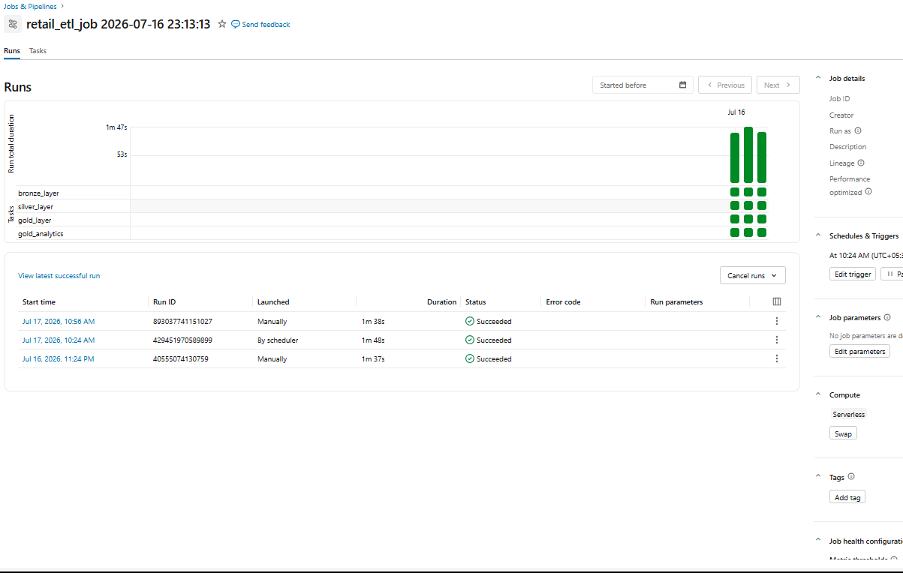
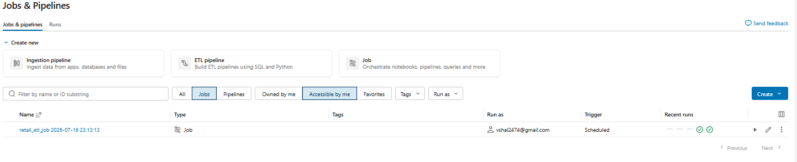

# Retail Data Engineering Pipeline

## Overview
End-to-end ETL pipeline built on Databricks using PySpark and SQL — 
no cloud services (AWS/Azure/GCP) used.

## Architecture
Medallion Architecture: Bronze -> Silver -> Gold

- **Bronze**: Raw ingestion via Databricks Auto Loader (incremental, 
  schema-tracked)
- **Silver**: Data cleaning (parsing nested product lists, timestamp 
  conversion, null handling, deduplication)
- **Gold**: Star schema (1 fact table + 4 dimension tables + 1 bridge 
  table for many-to-many product relationship)
- **Analytics**: SQL queries answering business questions (revenue 
  trends, top products, customer segmentation)

## Tech Stack
PySpark, SQL, Delta Lake, Databricks Workflows, Databricks Auto Loader

## Orchestration
4-task Databricks Workflow job, chained with dependencies, scheduled 
daily.

## Project Screenshots

### Bronze Layer

### Silver Layer

### Gold Layer

### Analytics

### Jobs & Scheduling

## Dataset
[Retail Transactions Dataset](https://www.kaggle.com/datasets/prasad22/retail-transactions-dataset) 
(~1M rows) from Kaggle — contains transaction, customer, product, payment, 
city, store type, discount, customer category, season, and promotion fields.

**Note:** The raw dataset is not included in this repo due to size. Download 
it from the link above and place it in your Databricks Volume path 
(`/Volumes/workspace/default/retail_data/`) before running the notebooks.
